<!-- START doctoc generated TOC please keep comment here to allow auto update -->
<!-- DON'T EDIT THIS SECTION, INSTEAD RE-RUN doctoc TO UPDATE -->
**Table of Contents**

- [Name Resolution](#name-resolution)
  - [Why do we need DNS?](#why-do-we-need-dns)
    - [Domain Name System (DNS)](#domain-name-system-dns)
    - [Domain Name](#domain-name)
  - [The Many Steps of Name Resolution](#the-many-steps-of-name-resolution)
    - [Caching and Recursive name servers](#caching-and-recursive-name-servers)
    - [Recursive name servers](#recursive-name-servers)
    - [A Typical DNS Query](#a-typical-dns-query)
    - [Anycast](#anycast)
  - [DNS and UDP](#dns-and-udp)
- [Name Resolution is Practice](#name-resolution-is-practice)
  - [Resource Record Types](#resource-record-types)
    - [A record](#a-record)
    - [AAAA - Quad A](#aaaa---quad-a)
    - [CNAME](#cname)
    - [MX record - mail exchange](#mx-record---mail-exchange)
    - [SRV record - service record](#srv-record---service-record)
    - [TXT record - text](#txt-record---text)
  - [Anatomy of a Domain Name](#anatomy-of-a-domain-name)
    - [Top level domain (TLD)](#top-level-domain-tld)
    - [Domains](#domains)
    - [Subdomain](#subdomain)
    - [Full qualified domain name (FQDN)](#full-qualified-domain-name-fqdn)
  - [DNS Zones](#dns-zones)
    - [Zone files](#zone-files)
    - [Start of authority (SOA)](#start-of-authority-soa)
    - [NS records](#ns-records)
    - [Reverse lookup zone files](#reverse-lookup-zone-files)
    - [Pointer resource record (PTR)](#pointer-resource-record-ptr)
- [Dynamic Host Configuration Protocol](#dynamic-host-configuration-protocol)
  - [Overview of DHCP](#overview-of-dhcp)
    - [DHCP](#dhcp)
    - [Dynamic Allocation](#dynamic-allocation)
    - [Automatic Allocation](#automatic-allocation)
    - [Fixed Allocation](#fixed-allocation)
    - [Network time protocol (NTP) servers](#network-time-protocol-ntp-servers)
  - [DHCP in Action](#dhcp-in-action)
    - [DHCP discovery](#dhcp-discovery)
- [Network Address Translation](#network-address-translation)
  - [Basics of NAT](#basics-of-nat)
    - [Network Address Translation (NAT)](#network-address-translation-nat)
  - [NAT and the Transport Layer](#nat-and-the-transport-layer)
    - [Port preservation](#port-preservation)
    - [Port forwarding](#port-forwarding)
  - [NAT, Non-Routable Address Space and the Limits of IPv4](#nat-non-routable-address-space-and-the-limits-of-ipv4)
- [VPNs and Proxies](#vpns-and-proxies)
  - [Virtual Private Networks](#virtual-private-networks)
    - [Two-factor authentication](#two-factor-authentication)
  - [Proxy Services](#proxy-services)
    - [Reverse proxy](#reverse-proxy)

<!-- END doctoc generated TOC please keep comment here to allow auto update -->

# Name Resolution

## Why do we need DNS?

- Human brain is not good at remembering numbers
- So a system called DNS is developed to assign those IP addresses to memorable domain names

### Domain Name System (DNS)

"A global and highly distributed network service that resolves strings of letters into IP addresses for you."

### Domain Name

"The term we use for something that can be resolved by DNS."

## The Many Steps of Name Resolution

There are five primary types of DNS servers;

- Caching name servers

- Recursive name servers

- Root name servers (13 root servers all over world)

- TLD name servers

- Authoritative name servers

### Caching and Recursive name servers

Purpose is to store known domain name lookups for a certain amount of time.

### Recursive name servers

- Perform full DNS resolution requests

- Time to live (TTL)

  > A value, in seconds, that can be configured by the owner of a domain name for how long a name server is allowed to cache an entry before it should discard it and perform a full resolution again

### A Typical DNS Query

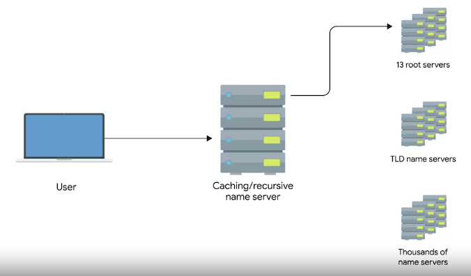 

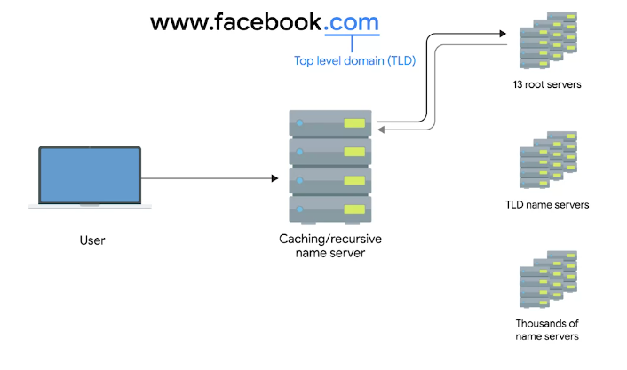

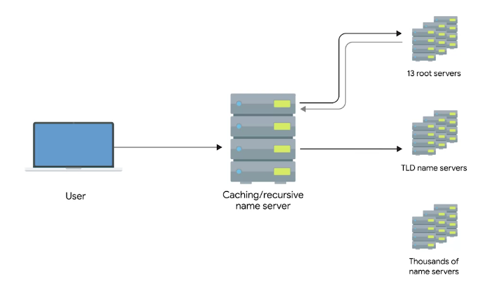

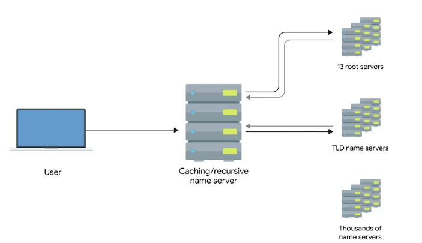

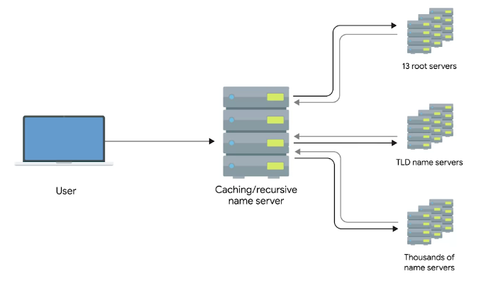

### Anycast

"A technique that's used to route traffic to different destinations depending on factors like location, congestion, or link health."

## DNS and UDP

- DNS, an application layer service, uses UDP

- A full DNS lookup with TCP in use, will use 44 total packets

  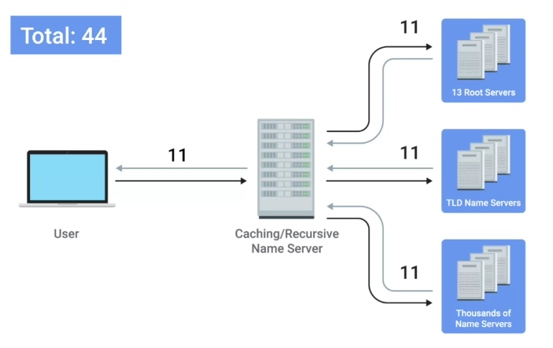 

- A full DNS lookup with UDP on the other hand require only 8 packets

- Error recovery is done by asking again in the UDP as no error check is present

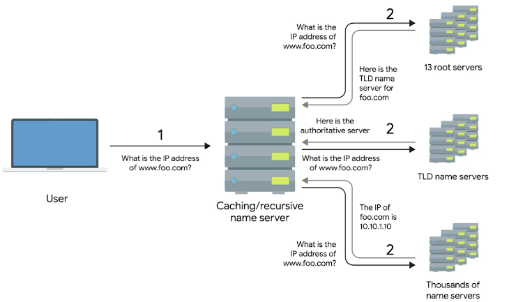 

# Name Resolution is Practice

## Resource Record Types

### A record

"An **A record** is used to point a certain domain name at a certain IPv4 IP address."

- A single A record is configured for single domain

- But a single domain name can have multiple A records, this allows for a technique known as **DNS round-robin** to be used to balance traffic across multiple IPs
  
  > Round-robin is a concept that involves iterating over a list of items one by one in an orderly fashion. The hope is that this ensures a fairly equal balance of each entry on the list that's selected.

### AAAA - Quad A

"Quad A record is used to point a certain domain name at a certain IPv6 IP address."

### CNAME

"A CNAME record is used to redirect traffic from one domain name to another."

### MX record - mail exchange

"This resource record is used in order to deliver e-mail to the correct server."

### SRV record - service record

"It's used to define the location of various specific services."

- MX record is only used for e-mails, SRC is used for every other service
  
  + I.e. caldav (calendar and scheduling service)

### TXT record - text 

- Used to communicate configuration preferences of a domain

## Anatomy of a Domain Name

### Top level domain (TLD)

The last part of a domain name. E.g. **.com, .net etc.**

- TLDs are handled by non-profit **The Internet Corporation for Assigned Names and Number (ICANN)** 

- **ICANN** is a sister organization to **IANA**, together both help define and control the global IP spaces and DNS system

### Domains

"Used to demarcate where control moves from a TLD name server to an authoritative name server."

### Subdomain

"The **www** portion of a domain."

### Full qualified domain name (FQDN)

When you combine all of these parts together, you have what's known as this.

- A DNS can technically support up to **127 level** of domain in total for a single fully qualified domain name

- Some other restrictions are, each individual section can only be **63 characters** and a **complete FQDN** is limited to **255 characters**

## DNS Zones

"An authoritative name server is actually responsible for a specific DNS zone."

- Allow for easier control over multiple level of a domain

- DNS zones are a hierarchical concept. The root name servers are responsible for some even finer-grained zones underneath that

- The root and TLD name servers are actually just authoritative name servers, too. It's just that the zones that they're authoritative for are special zones.

- E.g. a large company has three servers, one in LA, other in Paris and 3rd one in Shanghai. It will have three zones that and fourth for large company server so in total **4 DNS server zones**.

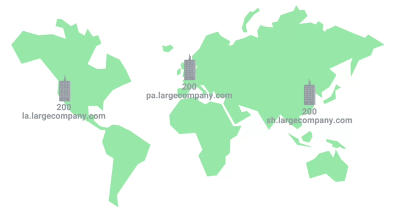 

### Zone files

"Simple configuration files that declare all resource record for a particular zone."

### Start of authority (SOA)

"Declares the zone and the name of the name server that is authoritative for it."

### NS records

"Indicate other name servers that might also be responsible for this zone."

### Reverse lookup zone files

These let DNS resolvers ask for an IP and get the FQDN associated with it returned.

### Pointer resource record (PTR)

Resolves an IP to a name.

# Dynamic Host Configuration Protocol

## Overview of DHCP

Every single computer on a modern TCP/IP based network needs to have at least four things specifically configured;

- IP address

- Subnet mask

- Gateway

- Name server

### DHCP

"An application layer protocol that automates the configuration process of hosts on a network."

- Resolves problem having to manually give an IP address to a device each time, it connects to the internet.

- DHCP works on some standards, like **Dynamic allocation**.

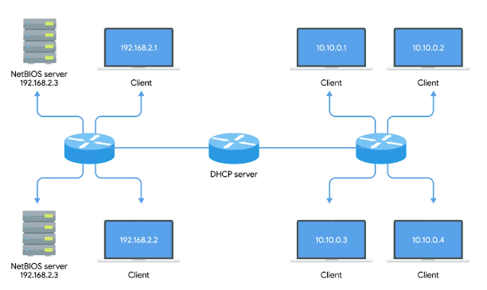 

### Dynamic Allocation

"A range of IP addresses is set aside for client devices and one of these IPs is issued to these devices when they request one."

- Under Dynamic allocation, IP of the computer is different every time, it connects to the Internet. It is done by **automatic allocation**.

### Automatic Allocation

"A range of IP addresses is set aside for assignment purposes."

- The main difference is that, the DHCP server is asked to keep track of which IPs it's assigned to certain devices in the past.

- Using this information, the DHCP server will assign the same IP to the same machine each time if possible.

### Fixed Allocation

Requires a manually specified list of MAC address and their corresponding IPs.

### Network time protocol (NTP) servers

"Used to keep all computers on a network synchronized in time."

- DHCP keeps track NTP

## DHCP in Action

It is an application layer protocol, so it relies on:

  + Transport layer

  + Network layer

  + Data link layer

  + Physical layer

So, how DHCP works in practice:

### DHCP discovery

"The process by which a client configured to use DHCP attempts to get network configuration information."

It has four steps

  + The DHCP clients sends what's known as a DHCP discover message out onto the network.

  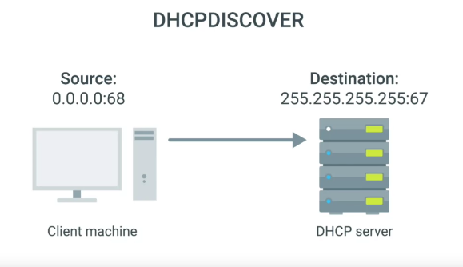

  + The response is sent via DHCP offer message.

  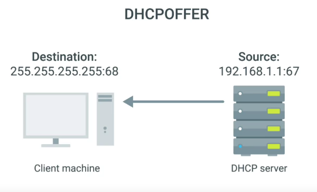 

  + DHCP client will respond to DHCP offer message with **DHCP request** message.

  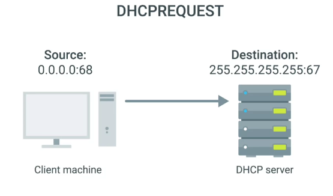 

  + DHCP server will receive DHCPREQUEST and respond with **DHCPACK** message

  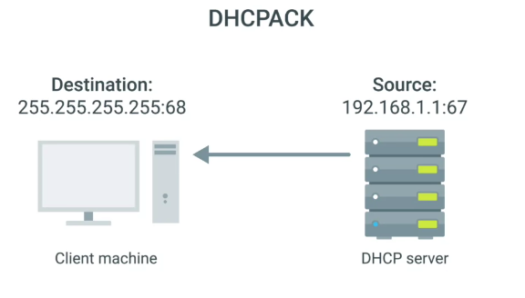 

  + All of this configuration is known as **DHCP lease** as it includes an expiration time. DHCP lease might last for days or only a short amount of time.

# Network Address Translation

## Basics of NAT

- It is a technique, instead of a protocol.

- Different hardware vendor implement NAT differently

### Network Address Translation (NAT)

"A technology that allows a gateway, usually a router or firewall, to rewrite the source IP of an outgoing IP datagram while retaining the original IP in order to rewrite it into the response."

- Hides the IP of computer originating the request. This is known as **IP masquerading**.

- To the outside world entire space of **Network A** is hidden and private. This is called **One-to-many NAT**.

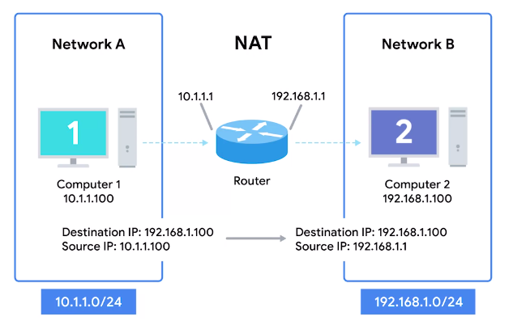 

## NAT and the Transport Layer

- When traffic is outbound, for hundreds even thousands of computers cal all have their IPs translated via NAT to a single IP.

- The concept become bit cumbersome when return traffic is involved.

- In inbound traffic we have potentially hundreds of responses all directed at the same IP, and the router at this IP needs to figure out which response go to which computer.

- The simplest way to do this, is **port preservation technique**.

### Port preservation

"A technique where the source port chosen by a client is the same port used by the router."

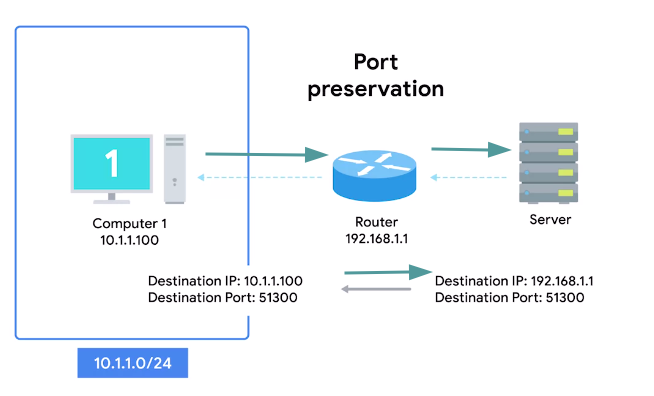 

### Port forwarding

"A technique where specific destination ports can be configured to always be delivered to specific nodes."

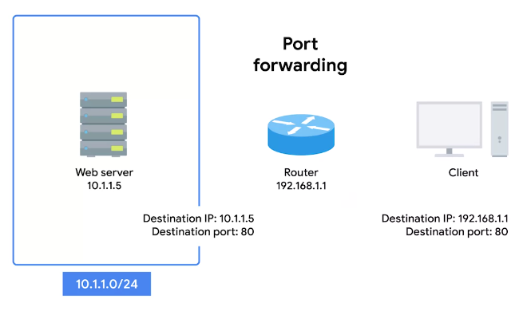 
## NAT, Non-Routable Address Space and the Limits of IPv4

**IANA** is in-charge of distributing IPs since 1988. The **4.2 billion** have run out since long.

- For some time now , the IANA has primarily been responsible with assigning address blocks to the five regional internet registries or **RIRs**.

  + **AFRINIC** servers the continent of **Africa**. (Mar 2017 - ran out of addresses)

  + **ARIN** serves the **USA, Canada, and parts of the Caribbean**. (Sep 2015 - ran out of addresses)

  + **APNIC** is responsible for most of **Asia, Australia, New Zealand, and Pacific island nations**. (2011 - ran out of addresses)

  + **LACNIC** covers **Central and South America and any parts of the Caribbean** not covered by **ARIN**. (June 2014 - ran out of addresses)

  + **RIPE** serves **Europe, Russia, the Middle East, and portions of Central Asia**. (Sep 2012 - ran out of addresses)

- The IANA assigned the last unallocated **/8** network blocks to the various **RIRs** on **February 3, 2011**.

- Solution is NAT, and Non-Routable Address Space, defined **rfc1918**.

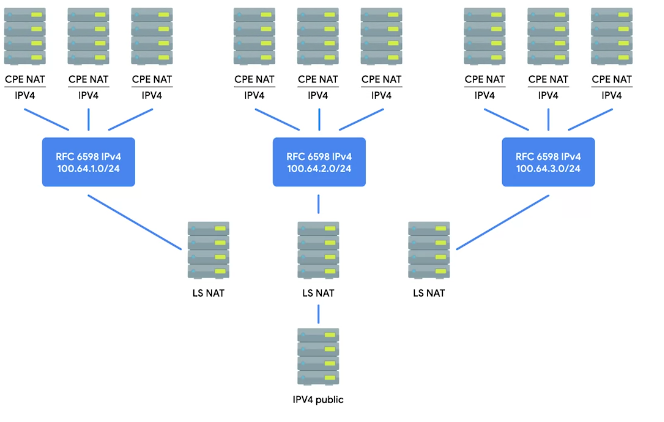 

# VPNs and Proxies

## Virtual Private Networks

"A technology that allows for the extension of a private or local network to hosts that might not be on that local network."

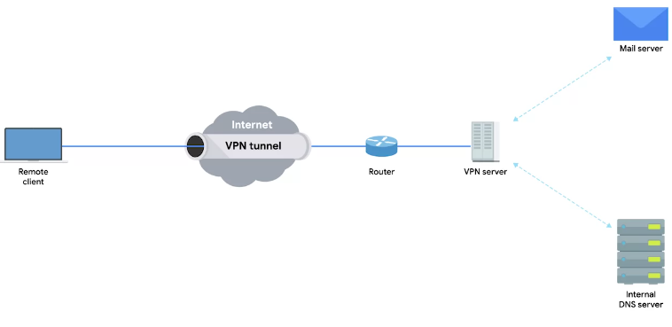 

- A VPN is tunneling protocol, it's basically a technique not a strict protocol which involves, using different methods.

- VPNs require strict authentication protocols to allow only access to the required clients

- VPNs were the first to implement the **2FA** on a large scale

- VPNs can be used to have site to site connectivity as well

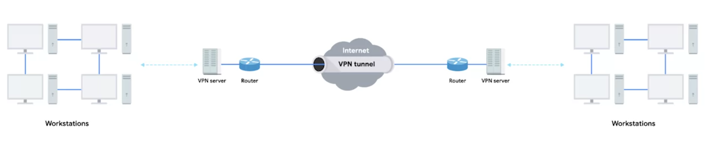

### Two-factor authentication

"A technique where more than just a username and password are required to authenticate."

## Proxy Services

"A server that acts on behalf of a client in order to access another service."

- They sit between client and server providing some additional benefits like;
  
  + Anonymity

  + Security

  + Content flittering

  + Increased performance

- The most common heard are **Web proxies** intended for web traffic. 

### Reverse proxy

"A service that might appear to be a single server to external clients, but actually represents many servers living behind it."

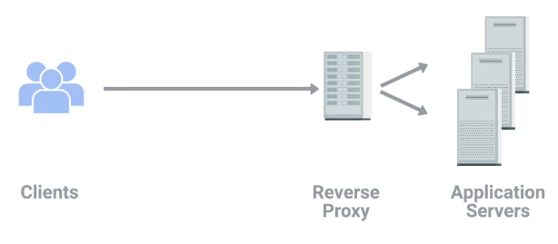
