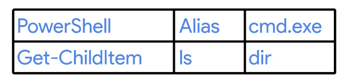

<!-- START doctoc generated TOC please keep comment here to allow auto update -->
<!-- DON'T EDIT THIS SECTION, INSTEAD RE-RUN doctoc TO UPDATE -->
**Table of Contents**  *generated with [DocToc](https://github.com/thlorenz/doctoc)*

- [Basic Commands](#basic-commands)
  - [List Directories in a GUI](#list-directories-in-a-gui)
  - [Windows List Directories in CLI](#windows-list-directories-in-cli)
  - [Linux: List Directories](#linux-list-directories)
    - [Flags](#flags)
  - [Windows: Changing Directories in a GUI](#windows-changing-directories-in-a-gui)
    - [Absolute path](#absolute-path)
    - [Relative path](#relative-path)
  - [Windows: Changing Directories in the CLI](#windows-changing-directories-in-the-cli)
  - [Windows: Making Directories in the & CLI](#windows-making-directories-in-the--cli)
  - [Linux: Making Directories in Bash](#linux-making-directories-in-bash)
  - [Windows: Command History](#windows-command-history)
  - [Windows: Copying Files & Directories](#windows-copying-files--directories)
    - [Wildcard](#wildcard)
  - [Linux: Copying Files & Directories](#linux-copying-files--directories)
- [File and Text Manipulation](#file-and-text-manipulation)
  - [Windows: Display File Contents](#windows-display-file-contents)
  - [Linux: Display File Contents](#linux-display-file-contents)
  - [Windows: Modifying Text Files](#windows-modifying-text-files)
  - [Windows PowerShell](#windows-powershell)
  - [Windows: Searching within Files](#windows-searching-within-files)
  - [Windows: Searching within Directories](#windows-searching-within-directories)
  - [Linux: Searching within Files](#linux-searching-within-files)
  - [Windows: Input, Output, and the Pipeline](#windows-input-output-and-the-pipeline)
  - [Linux: Input, Output, and the Pipeline](#linux-input-output-and-the-pipeline)
  - [Windows and Linux Advanced Navigation](#windows-and-linux-advanced-navigation)
    - [Regular expression (Regex)](#regular-expression-regex)

<!-- END doctoc generated TOC please keep comment here to allow auto update -->

# Basic Commands

In this we'll learn about:

- **Windows**

  + GUI (Graphical User Interface)

  + CLI (Command Line Interface)

- **Linux**

  + Command

  + Shell

  > The CLI interpreter in Linux is called a shell, and the language that we'll use to interact with this shell is called **Bash**.

## List Directories in a GUI

- In Windows, filesystems are assigned to drive letters, which look like **C:, or D:, or X:**.

- The parent/root directory of **C:** would be written **C:\**, and the root directory of **X:** would be written **X:\**.

- Subdirectories are separated by **\**.

## Windows List Directories in CLI

- To list contents of **C** drive

```powershell
ls C:\
```

- To get help for specific command

```powershell
Get-Help <command name>
```
  + In case of, `ls` command,

  ```powershell
  Get-Help ls
  ```

  + To get more detailed help

  ```powershell
  Get-Help ls-full
  ```

- To see hidden files in a directory

```powershell
ls -Force C:\
```

## Linux: List Directories

- To list the contents of root directory

```bash
ls /
```

  + **/bin**: essential binaries for program

  + **/etc**: system configuration file

  + **/home**: Where user files and configs live

  + **/proc**: Contain information of currently running processes

  + **/usr**: Meant for user installed software

  + **/var**: Stores system logs and anything that constantly changing

- `ls` command has very useful flags too.

- To see available flags for `ls`

```bash
ls --help
```

- `man` shows the manual pages.

```bash
man <command>
```
- To see hidden files, and long listing

```bash
ls -al
```

- You can hide a file by prepending a **.** in the start of the filename

### Flags

Similar to Windows command parameters a flag is a way to specify additional options for a command.

## Windows: Changing Directories in a GUI

### Absolute path

An absolute path is one that starts from the main directory.

### Relative path

A Relative path is the path from your current directory.

## Windows: Changing Directories in the CLI

- To know where you are in the folder

```powershell
pwd
```

- To change the directory you're in

```powershell
cd <path\to\the\directory>
```

- To go one level up

```powershell
cd ..
```
- Get to the $HOME directory

```powershell
cd ~
```
## Windows: Making Directories in the & CLI

- To make a new directory

```powershell
mkdir <directory name>
```
- To make a directory with spaces in its name

```powershell
mkdir 'directory name'
mkdir directory` name
```

## Linux: Making Directories in Bash

- To make a directory with spaces in its name

```bash
mkdir directory\ name
mkdir 'directory name'
```

## Windows: Command History

- To see the history of previous commands

```powershell
history
```

- To reverse-search through history shortcut is `<ctrl+r>`

- To clean PowerShell palette

```powershell
clear
```

 ## Windows: Copying Files & Directories

 - To copy a file

 ```powershell
cp <Path\to\the\file\to\be\copied> <Path\to\the\directory\of\copying> 
 ```

 - To copy multiple file at once, **Wildcard** is used

```powershell
cp *.<common pattern> <path\to\where\copied>
```
- To copy a directory and its content

```powershell
cp <directory name> <Path\to\where\copied> -Recurse -Verbose
```

### Wildcard

A character that's used to help select files based on a certain pattern.

 ## Linux: Copying Files & Directories

 - To copy a directory

 ```bash
cp <Directory/to/be/copied> <Path/where/to/be/copied>
 ```

# File and Text Manipulation

## Windows: Display File Contents

- To view the file contents

```powershell
cat <File Name>
```

- To view the file contents, one page at a time

```powershell
more <File Name>
```

- To see only part of the file contents

```powershell
cat <File Name> -Head <Number of Lines>
```

- To see only part of the file contents from the tail

```powershell
cat <File Name> -Tail <Number of Lines>
```

## Linux: Display File Contents

- To see file's contents, interactively

```bash
less <File Name>
```

- `more`, has been abandoned in favor of more useful `less` command in Linux.

- To see only part of file's contents, `head` is used, which by default only shows first 10 lines

```bash
head <File Name>
```

- To see only part of file's contents, `tail` is used, which by default only shows last 10 lines

```bash
tail <File Name>
```

## Windows: Modifying Text Files

- To modify file's contents from a CLI

```powershell
start notepad++ <File Name>
```

## Windows PowerShell

- PowerShell is a powerful and complex command line language. 

- To list directories, the real powershell command is can be found by:

```powershell
Get-Alias ls
```
so, to list directories

```powershell
Get-ChildItem <path\to\directory>
```

- Some old but not powerful as powershell, cmd.exe commands are



## Windows: Searching within Files

- In GUI, **Indexing Options** applications is used.

- In command-line, search is done as:

```powershell
Select-String <Search String> <path\to\the\file>
```
- To search in multiple files at once

```powershell
Select-String <Search String> *.<file extension name>
```

## Windows: Searching within Directories

- `-Filter` parameter is used with `ls` so search for particular files in a directory.

  + The `-Filter` parameter will filter the results for file names that match a pattern.

```powershell
ls <path\to\the\file> -Recurse -Filter *.exe
```
  
  + The **asterisk** means match anything, and the **.exe** is the file extension for executable files in Windows.

## Linux: Searching within Files

- To search in files

```bash
grep <Search String> <path/to/the/file>
```

- To search through multiple files at once

```bash
grep <Search String> *.txt
```

## Windows: Input, Output, and the Pipeline

```powershell
echo hello_word > hello.py
```

- The **echo** is an alias for PowerShell command `Write-Output`.

- Every Windows process and every PowerShell command can take input and can produce output. To do this, we use something called **I/O streams** or **input output streams**.

- I/O streams are

  + stdin

  + stdout

  + stderr

- The symbol **>** is something we call a **Redirector operator** that let us change where we want our **stdout** to go.

- The symbol **>>** is used to not create new file, just append the stdout

```powershell
echo 'Hello Planet' >> hello.py
```

- `|` pipe operator is used to redirect the stdout of one command to stdin of another command.

```powershell
cat hello.py | Select-String planet
```

- To put new stdout to a new file.

```powershell
cat hello.py | Select-String pla > planet.txt
```

- If we don't want to see error in CLI, to get them in a file

```powershell
rm secure_file 2> error.txt
```

  + **All the output streams are numbered, 1 is for stdout and 2 for stderr**

- If we don't care about error messages and don't want to save them in a file, we can redirect them to null variable (a black hole for stderr)

```powershell
rm secure_file 2> $null
```

## Linux: Input, Output, and the Pipeline

- In Linux, **stdin** operator can be used via symbol **<**.

```bash
cat < SomeFile.py
```
  + Here we are using **<** operator for file input instead of keyboard input.

- To redirect error message to a file

```bash
ls /dir/fake_dir 2> error_output.txt
```

- To filter out error message completely without saving

```bash
ls /dir/fake_dir 2> /dev/null
```

## Windows and Linux Advanced Navigation

- For more advance navigation, **regex** is used.

### Regular expression (Regex)

Used to help you do advance pattern-based selections.
