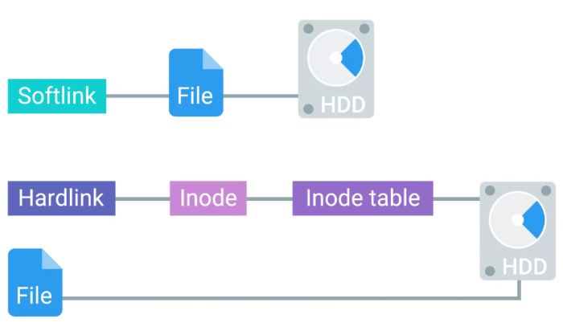
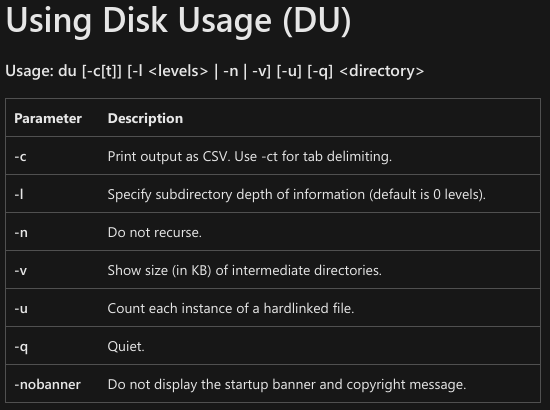

<!-- START doctoc generated TOC please keep comment here to allow auto update -->
<!-- DON'T EDIT THIS SECTION, INSTEAD RE-RUN doctoc TO UPDATE -->
**Table of Contents**  *generated with [DocToc](https://github.com/thlorenz/doctoc)*

- [Filesystem Types](#filesystem-types)
  - [Review of Filesystems](#review-of-filesystems)
  - [Disk Anatomy](#disk-anatomy)
    - [Partition](#partition)
    - [Partition Table](#partition-table)
  - [Windows: Partitioning and Formatting a Filesystem](#windows-partitioning-and-formatting-a-filesystem)
    - [Diskpart](#diskpart)
    - [Cluster](#cluster)
      - [Cluster size](#cluster-size)
    - [Volume](#volume)
    - [Partition](#partition-1)
  - [Windows: Mounting and Unmounting a Filesystem](#windows-mounting-and-unmounting-a-filesystem)
    - [Mounting](#mounting)
  - [Linux: Disk Partitioning and Formatting a Filesystem](#linux-disk-partitioning-and-formatting-a-filesystem)
    - [Parted](#parted)
  - [Linux: Mounting and Unmounting a Filesystem](#linux-mounting-and-unmounting-a-filesystem)
    - [File System table (fstab)](#file-system-table-fstab)
  - [Windows: Swap](#windows-swap)
    - [Virtual memory](#virtual-memory)
  - [Linux: Swap](#linux-swap)
    - [Swap space](#swap-space)
  - [Windows: Files](#windows-files)
    - [File metadata](#file-metadata)
    - [Master File Table (MFT)](#master-file-table-mft)
  - [Linux: Files](#linux-files)
  - [Windows: Disk Usage](#windows-disk-usage)
    - [Defragmentation](#defragmentation)
  - [Linux: Disk Usage](#linux-disk-usage)
  - [Windows: File-system Repair](#windows-file-system-repair)
    - [Data buffer](#data-buffer)
  - [Linux: File-system Repair](#linux-file-system-repair)

<!-- END doctoc generated TOC please keep comment here to allow auto update -->

# Filesystem Types

## Review of Filesystems

- FAT32 reading and writing data to Windows, Linux, and MacOS

  + Shortcomings are, max file size supported is 4 GB

  + Max file system 32 GB

 

 
## Disk Anatomy

- A storage device can be divided into partitions

- You can dual-boot Windows and Linux, with disk partitions dedicated for each.

- Other component is Partition table

  + Two main Partition tables are used

    + Master Boot Record (MBR)

     

    + GUID Partition Table (GPT)

     

  + For new booting standard UEFI, you need GPT table.

### Partition

The piece of a disk that you can manage.

### Partition Table

Tells the OS how the disk is partitioned.

## Windows: Partitioning and Formatting a Filesystem

- Windows ships with great tool, **Disk Management** Utility.

- To manage disks from CLI, tool called `Diskpart` is used.

### Diskpart

Typing `Diskpart` in the CLI, will open interactive shell.

Next type `list disk` to list out all the storage devices on your computer

Then to select a disk:

```console
select disk <Disk ID>
```

After to wipe all volumes and files from the disk type `clean` in the interactive shell.

To create blank partition in a disk

```console
create partition primary
```

Then, to select the newly created partition

```console
select partition 1
```

To mark it as active, simply type `active`.

To format the disk with filesystem:

```console
format FS=NTFS label=<Label the Disk> quick
```

### Cluster

Cluster (allocation unit size) is the minimum amount of space a file can take up in a volume or drive.

#### Cluster size

Cluster size is the smallest division of storage possible in a drive. Cluster size is important because a file will take up the entire size of the cluster regardless of how much space it actually requires in the cluster.

- For example, if the cluster size is 4kb (the default size for many formats and sizes) and the file you're trying to store is 4.1kb, that file will take up 2 clusters. This means that the drive has effectively lost 3.9 kb of space for use on a single file.

 

### Volume

A single accessible storage area with a single file system; this can be across a single disk or multiple.

### Partition

A logical division of a hard disk that can create unique spaces on a single drive. Generally used for allowing multiple operating systems.

## Windows: Mounting and Unmounting a Filesystem

- When you plug a USB drive, it shows up in the list of your devices, and you can start using it right away.

- When done using, safely eject it.

### Mounting

Making something accessible to the computer, like filesystem or a hard disk.

## Linux: Disk Partitioning and Formatting a Filesystem

- There are different disk partitioning CLI tools
  
  + `parted`: can be used in both interactive and in commandline.

### Parted

To list the devices

```bash
sudo parted -l
```

To run parted in interactive mode on some disk

```bash
sudo parted /dev/sdX
```

You can use help to see different commands used in the interactive mode.

To format the partition with filesystem using `mkfs`

```bash
sudo mkfs -t ext4 /dev/sdXx
```

## Linux: Mounting and Unmounting a Filesystem

To mount the previously formatted disk

```bash
sudo mount /dev/sdXx /my_disk/
```

To unmount the disk

```bash
sudo umount /dev/sdXx
```

### File System table (fstab)

To permanently mount a disk we need to make changes in a `fstab` file.

The `fstab` configuration table consists of six columns containing the following parameters:

  + Device name or UUID (Universally Unique ID)

  + Mount Point: Location for mounting the device

  + Filesystem Type

  + Options : list of mounting options in use, delimited by commas.

  + Backup operation of dump - this is an outdated method for making device or partition backups and command dumps. It should not be used. In the past, this column contained a binary code that signified:

    + 0 = turns off backups

    + 1 = turns on backups

  + Filesystem check (fsck) order or Pass - The order in which the mounted device should be checked by the `fsck` utility:

    + 0 = `fsck` should not run a check on the filesystem

    + 1 = mounted device is the root file system and should be checked by the `fsck` command first.

    + 2 = mounted device is a disk partition, which should be checked by `fsck` command after the root file system.

Example of an `fstab` table:

 

To get a UUID of a disk

```bash
sudo blkid
```

 


## Windows: Swap

- Windows use **Memory Manager** to handle virtual memory.

- In Windows, pages saved to disk are stored in a special hidden file on the root partition of a volume called **pagefile.sys**

- Windows provides to way to modify size, number and location of paging files through a control panel applet called **System Properties**.

### Virtual memory

How our OS provides the physical memory available in our computer (like RAM) to the applications that run on the computer.

## Linux: Swap

- You can make swap, with tools like `fdisk`, `parted`, `gparted` etc.

- To make it auto-mount on system start, add its entry in the `fstab` file.

### Swap space

In Linux, the dedicated area of the hard drive used for virtual memory.

## Windows: Files

- NTFS uses **Master File Table or MFT** to represent the files.

- Every file on the system has at least one entry on the MFT

- Shortcut is an MFT entry which takes us to the specific location of a file, which it is a shortcut of.

- Other methods to link to files are:

  + Symbolic Links: OS treats Symbolic links just like the files themselves

To create a symbolic link:

```powershell
mklink <Symlink Name> <Original File Name> 
```

  + Hard Links: When you create a hard link in NTFS, an entry is added to the MFT that points to the linked file record number, not the name of the file. This means the file name of the target can change and the hard link will still point to it

To create a hard link:

```powershell
mklink /H <Hard link Name> <Original File Name>
```

 

### File metadata

All the data, other than the file contents.

### Master File Table (MFT)

The NTFS file system contains a file called the master file table or MFT, There is at least one entry in the MFT for every file on an NTFS file system volume, including the MFT itself.

- All information about a file, including its size, time and date stamps, permissions, and data content, is stored either in MFT table, or in space outside the MFT that describe by MFT entries.

- As files are added to an NTFS file system volume, more entries are added to the MFT and the MFT increases in size. When files are deleted from an NTFS file system volume, their MFT entries are marked as free and may be reused.

## Linux: Files

- In Linux, metadata and files are organized into a structure called an **inode**.

- Inode doesn't store filename and the file data.

- We store inodes in an **inode table** and they help us manage the files on our file system.

- Shortcut in Linux, referred as **Softlink**.

 

To create a soft link:

```bash
ln -s <File Name> <Softlink Name>
```

To create a hard link:

```bash
ln <File Name> <Hardlink Name>
```

- If you move a file, all the Softlinks, will be broken

## Windows: Disk Usage

- To check disk usage, open up, **computer management** utility.

- Disk cleanup is done through **CleanManager.exe**, to clear out, cache, log file, temporary files, and old file etc.

- Another disk health feature is **Defragmentation**.

  + This beneficial for spinning hard drives, and less of important for SSDs.

  + Defragmentation in spinning drives is handled by task schedulers in Windows automatically, and you don't need to worry about manual intervention most of the times.

  + To start manual defragmentation, start **Disk defragmenter** tool. 

- For Solid state drives, the system can use **Trim** feature to reclaim unused space.

- For CLI, disk cleanup `du` tool is used

 

### Defragmentation

The idea behind disk defragmentation is to take al the files stored on a given disk, and reorganize them into neighboring locations.

## Linux: Disk Usage

To see disk usage:

```console
du -h
```

`du` list file sizes of current directory if no option is specified.

To see free disk space:

```console
df -h
```

- Linux generally does a good job of avoiding fragmentation more than Windows.

## Windows: File-system Repair

- Ejecting a USB drive is necessary, as the file copying/moving might still be running in the background, even after successful copy/move prompt.

- When we read or write something to a drive, we actually put it into a buffer, or cache, first.

- If you don't give enough time for data to be moved away from buffer, you may experience a **Data corruption**.

- Power outage, system failure, or some bug in the OS or the program, can also cause data corruption.

- NTFS has some advanced feature in the form of **Data journaling**, which avoid data corruption or even attempts data recovery in case of failure.

- Minor errors and data corruptions are self healed by NTFS.

To check self-heal status:

```powershell
fsutill repair query C:
```

In case of catastrophic failure, run `chkdsk` tool in powershell as an admin, by default it will run in read only mode. So it will only report the error, and not fix it.

```powershell
chkdsk
```

To fix the errors

```powershell
chkdsk /F <Drive Path>
```

Most of the time, you won't need to run `chkdsk` manually, and OS will handle it for you running it, and then fixing the errors, by looking the at the NTFS Journaling log.

### Data buffer

A region of RAM that's used to temporarily store data while it's being moved around.

## Linux: File-system Repair

Run `fsck` on unmounted drive, otherwise it will damage it.

```bash
sudo fsck /dev/sdX
```

On some systems `fsck` runs automatically on boot.
