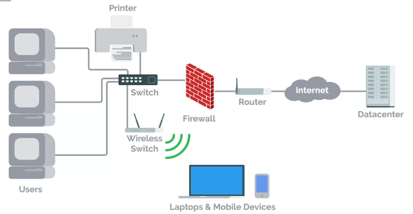
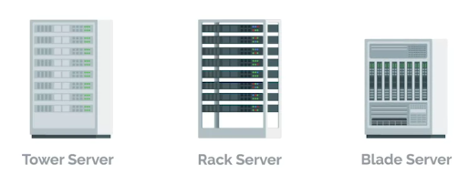
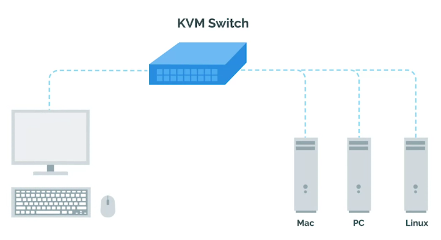
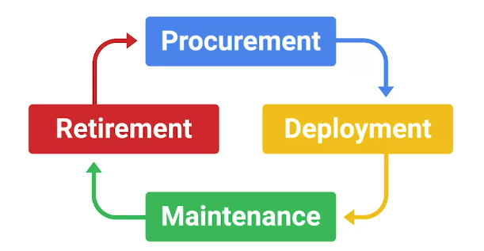

<!-- START doctoc generated TOC please keep comment here to allow auto update -->
<!-- DON'T EDIT THIS SECTION, INSTEAD RE-RUN doctoc TO UPDATE -->
**Table of Contents**  *generated with [DocToc](https://github.com/thlorenz/doctoc)*

- [Introduction to System Administration and IT Infrastructure Services](#introduction-to-system-administration-and-it-infrastructure-services)
    - [System Administration](#system-administration)
- [What is System Administration?](#what-is-system-administration)
    - [IT Infrastructure](#it-infrastructure)
  - [Servers Revisited](#servers-revisited)
    - [Server](#server)
    - [KVM Switch](#kvm-switch)
  - [The Cloud](#the-cloud)
    - [Data Center](#data-center)
- [Systems Administration](#systems-administration)
  - [Organizational Policies](#organizational-policies)
  - [User and Hardware Provisioning](#user-and-hardware-provisioning)
  - [Routine Maintenance](#routine-maintenance)
  - [Vendors](#vendors)
  - [Troubleshooting and Managing Issues](#troubleshooting-and-managing-issues)
  - [In Case of Fire, Break Glass](#in-case-of-fire-break-glass)
- [Applying Changes](#applying-changes)
  - [With Great Power Comes Great Responsibility](#with-great-power-comes-great-responsibility)
    - [script](#script)
    - [Start-Script](#start-script)
    - [Rollback](#rollback)
  - [Never Test in Production](#never-test-in-production)
    - [Production](#production)
    - [Test environment](#test-environment)
    - [Secondary or stand-by machine](#secondary-or-stand-by-machine)
  - [Assessing Risk](#assessing-risk)
  - [Fixing Things the Right Way](#fixing-things-the-right-way)
    - [Reproduction case](#reproduction-case)

<!-- END doctoc generated TOC please keep comment here to allow auto update -->

# Introduction to System Administration and IT Infrastructure Services

### System Administration

The field in IT that's responsible for maintaining reliable computer systems in a multi-user environment.

# What is System Administration?

### IT Infrastructure

IT Infrastructure encompasses the software, the hardware, network, services required for an organization to operate in an enterprise IT environment.

- **Sysadmins** work in the background to make sure company's IT infrastructure is always up and running.

- In large companies, **sysadmin** can be split-up into:

  + Network Administrators

  + Database Administrators

 

## Servers Revisited

- Sysadmins responsible for managing things like

  + Email

  + File storage

  + Running a website and more.

- These services are stored on servers.

### Server

Software or a machine that provides services to other software or machines.

Servers include:

  + Web server

  + Email server

  + SSH server

The servers can be of three the most common types in terms of their space efficiency:

  + Tower Servers

  + Rack Servers

  + Blade Servers

 

### KVM Switch

Keyboard, Video, and Mouse (KVM) is an industry standard hardware device for connecting directly to the servers.

 

## The Cloud

- Cloud computing a concept in which you can access your files, emails etc. from anywhere in the world.

- Cloud is not a magical thing, rather hundreds and even thousands of computer act as a server to form a cloud, somewhere in the data center.

### Data Center

A facility that stores hundreds, if not thousands, of servers.

# Systems Administration

## Organizational Policies

- In a small company, it's usually a Sysadmin's responsibility to decide what computer policies to use.

- In larger companies with hundreds of employees or more, this responsibility usually falls under the **chief security officer or CSO**.

## User and Hardware Provisioning

In other responsibilities Sysadmins have is managing users and hardware.

There are four stages of hardware life cycle

 

## Routine Maintenance

To affectively update a fleet of hardware, you set up a **Batch update**, once every month or so, depending upon company policies.

Good practice is to install security and critical bug fixes routinely.

## Vendors

- Not only do sysadmins in a small company work with using computers, they also have to deal with printers and phone, too.

- Whether your employees have cellphones or desk phones, their phone lines have to be setup.

Other hardware generally used in companies is:

  + Printers

  + Fax machines

  + Audio/video conferencing equipment

- Sysadmins might be responsible for making sure printers are working or if renting a commercial printer, they have to make sure that someone can be on site to fix it.

- Setting up businesses account with vendors like **Hewlett Packard, Dell, Apple, etc. is usually beneficial since they generally offer discounts for businesses.

## Troubleshooting and Managing Issues

While working in an organization, sysadmins have to constantly troubleshoot and fix issues on machines.

**You need to prioritize the issues all the time**.

## In Case of Fire, Break Glass

As a sysadmin, you need to have some recovery plan for companies critical data and IT infrastructure in case of a critical failure.

# Applying Changes

## With Great Power Comes Great Responsibility

- Avoid using administrators rights for tasks that don't require them.

- When using Admin rights make sure to:

  + Respect the privacy of others.

  + Think before you type or do anything.

  + With great power comes great responsibility.

- Documenting what you do is pretty important, for future you or someone else in the company to troubleshoot the same issues.

  + `script` command used to record a group of commands as they're being issued in Linux

  + `Start-Transcript` is an equivalent command on Windows

  + We can record the desktop with some GUI application.

- Some commands are easy to rollback than others, so be careful of what you're doing.

### script

In the case of `script` you can call it like this:

```bash
script session.log
```

This writes the contents of your session to the **session.log** file. When you want to stop, you can write **exit** or press **CTRL+D**.

The generated file will be in **ANSI format** which includes the colors that were displayed on scree. In order to read them, you can use CLI tools like, **ansi2txt** or **ansi2html** to convert it to plain text or HTML respectively.

### Start-Script

In the case of `Start-Script`, you can call it like this:

```powershell
Start-Script -Path <drive>:\Transcript.txt # File name can be anything.
```

To stop recording you need to call `Stop-Transcript`. The file created is a plain text file where the commands executed, and their outputs are stored.

### Rollback

Reverting to the previous state is called a rollback.

## Never Test in Production

- Before pushing any changes to Production, test them first on the Test environment to make sure, they are bug free.

- If you're in charge of an important service that you need to keep running during a configuration change, it's recommended that you have secondary or stand-by machine.

- First apply the changes after testing them in the test environment, to the stand-by or secondary machine, then make that machine primary, and apply changes to the production machine.

- For even bigger services, when you have lots of servers providing the service, you may want to have **canaries**. (canaries: small group of servers, if anything still doesn't work, it shouldn't take down the whole infrastructure.)

### Production

The parts of the infrastructure where a certain service is executed and served to its users.

### Test environment

A virtual machine running the same configuration as the production environment, but isn't actually serving any users of the service.

### Secondary or stand-by machine

This machine will be exactly the same as a production machine, but won't receive any traffic from actual suers until you enable it to do so.

## Assessing Risk

There is no point of having test/secondary servers, when nobody cares about the downtime.

So, it's very important to assess the risk before going forward to invest in the backup plans.

In general, the more users your service reaches, the more you'll want to ensure that changes aren't disruptive.

To more important your service is to your company's operations, the more you'll work to keep the serve up

## Fixing Things the Right Way

### Reproduction case

Creating a roadmap to retrace the steps that led the user to an unexpected outcome.

When looking for Reproduction case, there are three questions you need to look for:

  + What steps did you take to get to this point?

  + What's the unexpected or bad result?

  + What's the expected result?

After applying your fix, retrace the same steps that took you to the bad experience. If your fix worked, the expected experience should now take place.
