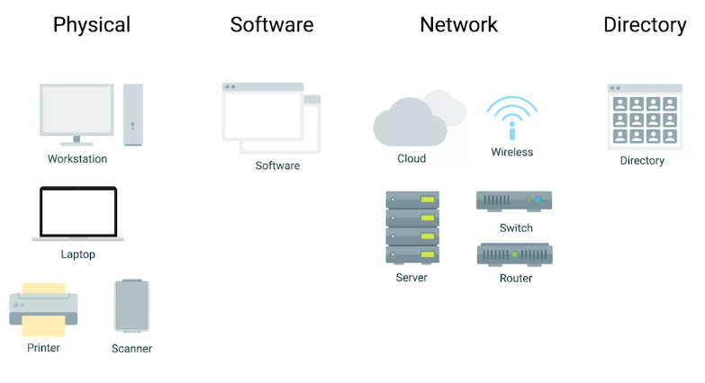
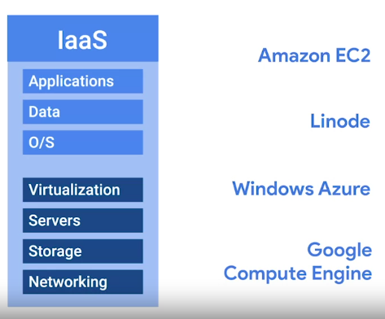
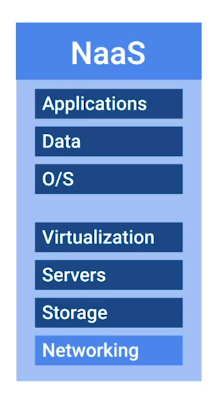
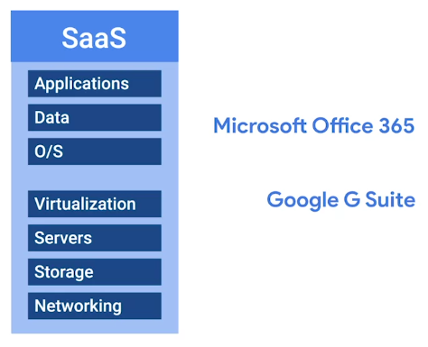
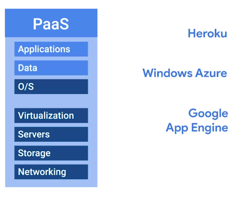
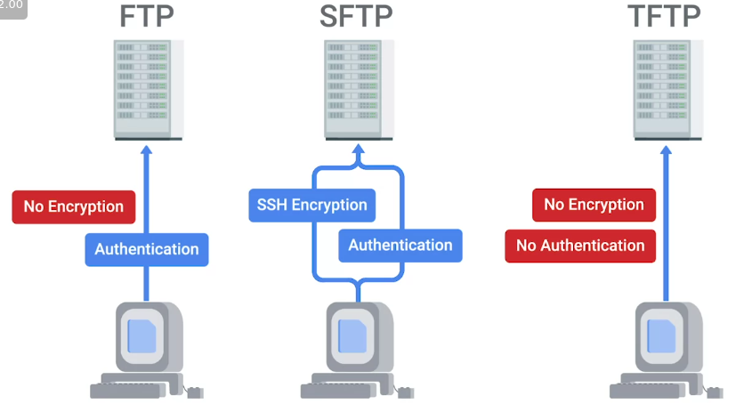
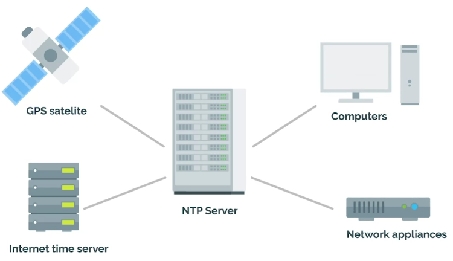
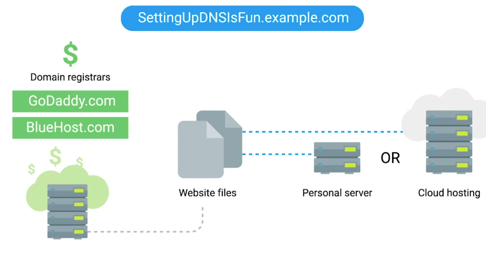
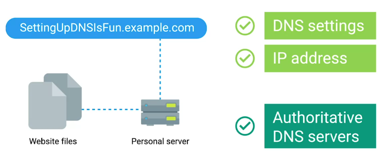

<!-- START doctoc generated TOC please keep comment here to allow auto update -->
<!-- DON'T EDIT THIS SECTION, INSTEAD RE-RUN doctoc TO UPDATE -->
**Table of Contents**  *generated with [DocToc](https://github.com/thlorenz/doctoc)*

- [Intro to IT Infrastructure Services](#intro-to-it-infrastructure-services)
  - [Types of IT Infrastructure Services](#types-of-it-infrastructure-services)
- [Physical Infrastructure Services](#physical-infrastructure-services)
  - [Server Operating Systems](#server-operating-systems)
  - [Virtualization](#virtualization)
- [Network Services](#network-services)
  - [FTP, SFTP, and TFTP](#ftp-sftp-and-tftp)
    - [PXE Boot (Preboot Execution)](#pxe-boot-preboot-execution)
  - [NTP (Network Time Protocol)](#ntp-network-time-protocol)
  - [Network Support Services Revisited](#network-support-services-revisited)
    - [Intranet](#intranet)
    - [Proxy server](#proxy-server)
  - [DNS](#dns)
  - [DNS for Web Servers](#dns-for-web-servers)
  - [DNS for Internal Networks](#dns-for-internal-networks)
  - [DHCP](#dhcp)
- [Troubleshooting Network Services](#troubleshooting-network-services)
  - [Unable to Resolve a Hostname or Domain Name](#unable-to-resolve-a-hostname-or-domain-name)
- [Managing System Services](#managing-system-services)
  - [What do Services Look Like in Action](#what-do-services-look-like-in-action)
  - [Managing Services in Linux](#managing-services-in-linux)
  - [Managing Services in Windows](#managing-services-in-windows)
  - [Configuring Services in Linux](#configuring-services-in-linux)
    - [lftp](#lftp)
    - [Reload](#reload)
  - [Configuring Services in Windows](#configuring-services-in-windows)
- [Configuring DNS with Dnsmasq](#configuring-dns-with-dnsmasq)
    - [dnsmasq](#dnsmasq)
  - [Configuring DHCP with Dnsmasq](#configuring-dhcp-with-dnsmasq)

<!-- END doctoc generated TOC please keep comment here to allow auto update -->

# Intro to IT Infrastructure Services

## Types of IT Infrastructure Services

 

- You can use **Cloud Infrastructure Services or IaaS**, if you don't want to use own hardware. Some common IaaS providers are:

  + Amazon EC2

  + Linode

  + Windows Azure

  + Google Compute Engine (GCP)

 

- Networks can be integrated into an IaaS

- But in recent years, **Network as a Service or NaaS** has emerged.

 

- Every company needs, some email service, word processor, ppt makers, CMS, etc. **Software as a Service or SaaS** can handle it for you.

 

- Some companies have a product built around a software application. In this case, there are some things that software developers need to be able to code, build and shape their software.

  + First, specific applications have to be installed for their programming development environment.

  + Then, depending on the product, they might need a database to store information.

  + Finally, if they're serving web content like a website, they might need to publish their product on the Internet.

  + For all in one solution, **Platform as a Service or PaaS**, is used.

 

- The last IT Infrastructure service we'll discuss is the management of users, access and authorization. A directory service, centralizes your organizations users and computers in one location so that you can add, update, and remove users and computers. Some popular directory services are:

  + Windows Active Directory (AD)

  + OpenLDAP

- The directory services can be directly deployed in the cloud via **Directory as a Service or DaaS**.

# Physical Infrastructure Services

## Server Operating Systems

Regular operating systems that are optimized for server functionality.

  + Windows Server

  + Linux Servers

  + MacOS Servers

## Virtualization

Advantages:

  + Resource Utilization

  + Maintenance

  + Point of Failure

  + Cost

  + Connectivity

Limitations:

  + Performance

# Network Services

## FTP, SFTP, and TFTP

- Network service commonly used in an organization is **File transfer service**.

 

### PXE Boot (Preboot Execution)

It allows you to boot into software available on the network.

## NTP (Network Time Protocol)

- One of the oldest network protocols

- You can use Public NTP server, or deploy you own if you have fleet of hundreds and thousands of computers.

 

## Network Support Services Revisited

- There are a few services that are used internally in an IT enterprise environment, to improve employee productivity, privacy and security.

  + Intranet

  + Proxy servers

### Intranet

An internal network inside a company; accessible if you're on a company network.

### Proxy server

Acts as an intermediary between a company's network and the Internet.

## DNS

Maps human-understandable names to IP addresses.

## DNS for Web Servers

- First we need a domain name.

 

- We can also have own server, pointed to the domain name.

 

## DNS for Internal Networks

- The other reason we might want our own DNS servers is, so we can map our internal computers to IP addresses. That way, we can reference a computer by name, instead of IP address.

  + You can do this through hosts files.

  + Hosts, files allow us to map IP addresses to host name manually.

  + AD/OpenLDAP can be used to handle user and machine information in its central location. Once local DNS servers is set, it will automatically populate with machine to IP address mappings.

- Option for Custom DNS server setup:

  + [BIND](https://www.isc.org/downloads/bind/) 

  + [PowerDNS](https://www.powerdns.com/)

  + [DNSmasq](http://www.thekelleys.org.uk/dnsmasq/doc.html)

  + [Erl-DNS](https://github.com/dnsimple/erldns)

## DHCP

- When connecting to a network, you have two options for IP address assignment:

  + Static IP

  + DHCP assigned IP

# Troubleshooting Network Services

## Unable to Resolve a Hostname or Domain Name

- To check if website accepts ping requests

```bash
ping google.com
```

- To verify if you DNS is giving you correct address for <google.com>

```bash
nslookup google.com
```

- Remember that when a DNS query is performed, your computer first checks host file. To access a host file:

```bash
sudo vim /etc/hosts
```

# Managing System Services

## What do Services Look Like in Action

- We have looked at many services so far:

  + DHCP

  + DNS

  + NTP etc.

- It's important to understand how the programs that provide these services operate. So, that you can manage them and fix any problems that pop-up.

- These programs as background processes, also known as daemons, or just services.

  + This means that the program doesn't need to interact with a user through the graphical interface or the CLI to provide the necessary service.

- Each service has one or more configuration file, you as sysamdin will determine how to operate.

- Some services offer interactive interface for configuration and changes, others may rely on the system's infrastructure.

  + It means you need to edit configuration file yourself.

  + You should also know how to start or stop a service.

- Services are usually configured to start when the machine boots, so that if there's a power outage or a similar event that causes the machine to reboot, you won't need a system administrator to manually start the service.

## Managing Services in Linux

- To check if NTP daemon running on a system

```bash
timedatectl
```

- If there is change of more than **120ms**, NTP daemon will not adjust for the change.

- Stopping and starting the NTP service manually, will adjust the clock to correct settings.

- Restart first Stops and then Start the service.

## Managing Services in Windows

Here for example, we will deal with Windows Update Service

To check the status of the service:

```powershell
Get-Service wuauserv # Short hand for Windows Update Service
```

To get more information about the service:

```powershell
Get-Service wuauserv | Format-List *
```

To stop service (Admin required):

```powershell
Stop-Service wuauserv
```

To start a service (Admin required):

```powershell
Start-Service wuauserv
```

To list all services running in the system:

```powershell
Get-Service
```

**Same actions can be performed via **Service Management Console** in GUI.

## Configuring Services in Linux

- Most services are enabled as you install them, they are default services ship with the program itself.

- The configuration files for the installed services are located in the `/etc` directory.

- Here we will use the example of ftp client.

- After installing ftp client `vsftpd`, it will start the service automatically.

- We can start ftp client

```bash
lftp localhost
```

  + It requires username and password to view contents

- To enable anonymous ftp logins, we can edit the conf file in `/etc/vsftpd.conf`

  + Then reload the ftp client

```bash
sudo service vsftpd reload
```

### lftp

A ftp client program that allows us to connect to a ftp server.

### Reload

The service re-reads the configuration without having to stop and start.

## Configuring Services in Windows

Here as an example we will use **Internet Information Services**, the feature offered by Windows to serve the web pages.

- First, Turn Feature ON and OFF in the settings to first enable it.

To Feature ON/OFF from the CLI

```powershell
Install-WindowsFeature Web-WebServer,Web-Mgmt-Tools -IncludeAllSubFeature
```

- Then we can add and remove **IIS** in the server manager, where **IIS** tab is now available after applying the above changes.

# Configuring DNS with Dnsmasq

### dnsmasq

A program that provides DNS, DHCP, TFTP, and PXE services in a simple package.

To install it:

```bash
sudo apt install dnsmasq
```

It immediately gets enabled with basic functionality, provides cache for DNS queries. This means you can make DNS request to it, and it'll remember answers, so your machine doesn't need to ask an external DNS server each time

To check this functionality, we'll use `dig` command which lets us query DNS servers and see their answers:

```bash
dig www.example.com @localhost
```

Part after `@` sign specifies which DNS server to use for query.

To see what's happening in the background, we can run `dnsmasq` in the debug mode.

First stop the service:

```bash
sudo service dnsmasq stop
```

Now, run it in debug mode:

```bash
sudo dnsmasq -d -q
```

Now open a second console, and run `dig` command again, `dnsmasq` console running with flags `-d` (debug), `q` (query logging)

## Configuring DHCP with Dnsmasq

- A DHCP server is usually set up on a machine or a device that has a static IP address configured to the network interface which is being used to serve the DHCP queries. That interface is then connected to the physical network that you want to configure through DHCP, which can have any number of machines on it. In real life, the DHCP server and the DHCP client usually run on two separate machines.

- For this example we'll use single machine

- In this machine, we have an interface called eth_srv, that's configured to be the DHCP server's interface. 

- We also have an interface called eth_cli, which is the interface that we'll use to simulate a client requesting an address using DHCP. This interface doesn't have an IP configured yet.

- So, I'm going to type in 

```bash
ip address show eth_cli
```

We can see that this interface doesn't have an IPV4 address configured. We will change this by using our DHCP server. To do this, we need to provide additional configuration to dnsmasq. There are lots of things we can configure. We're going to use a very basic set of options. Let's look at the configuration file.

```bash
cat DHCP config.
```

The interface option tells dnsmasq that it should listen for DHCP queries on the eth_srv interface. The bind interfaces option tells it not to listen on any other interfaces for any kind of queries. This allows us to have more than one dnsmasq server running at the same time each on its own interface. The domain option tells the clients, the networks domain name and will be used for querying host names. Then, we have two different DHCP options, which are additional information that will be transmitted to DHCP clients when the IP is assigned. In this case, we're telling clients what to configure as a default gateway and which DNS servers should be used. There are a lot more options that we can set, but these two are the most common ones.

- Finally, we configure the DHCP range. This is the range of IP addresses that the DHCP server can hand out. Depending on your specific setup, you may want to reserve some addresses in your network for machines that need to have a static address. If you don't plan to do that, you can make the range larger, but make sure you don't include the address of the DHCP server itself. The last value in the DHCP range Line is the length of the lease time for the IP address. In this case, it's 12 hours, which means that once an address is assigned to a machine, it will be reserved for that machine for those 12 hours. If the lease expires without the client renewing it, the address can be assigned to a different machine.

Let's tell dnsmasq to start listening for queries using this config.

```bash
sudo dnsmasq -d -q -c dhcp.conf
```

We can see in the output that dnsmasq is listening for DHCP queries on the eth_srv interface with the options that we set in our configuration file. Now, let's run a DHCP client on a second terminal.

```bash
sudo dhclient -i eth_cli -v 
```

We're using dhclient which is very common DHCP client on Linux. We're telling it to run on the eth_cli interface and we're using the -v flag to see the full output of what's happening.

```bash
ip address show eth_cli
```

Our eth_cli interface has successfully acquired an IP address.
