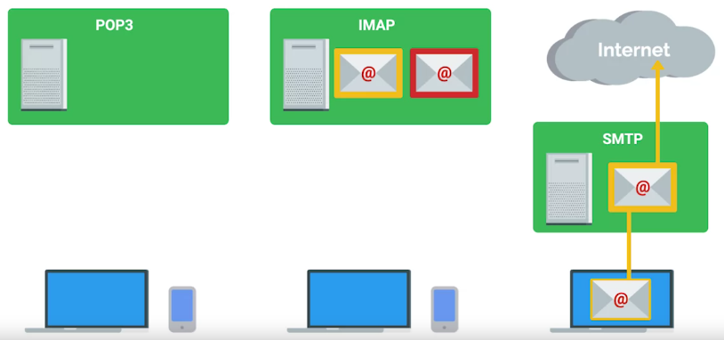
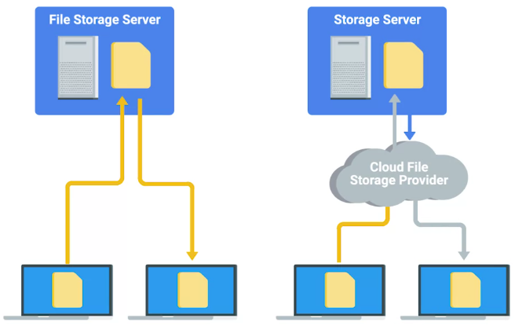
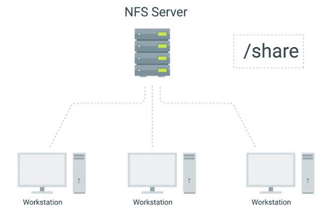

<!-- START doctoc generated TOC please keep comment here to allow auto update -->
<!-- DON'T EDIT THIS SECTION, INSTEAD RE-RUN doctoc TO UPDATE -->
**Table of Contents**  *generated with [DocToc](https://github.com/thlorenz/doctoc)*

- [Software Services](#software-services)
    - [Platform services](#platform-services)
  - [Configuring Communication Services](#configuring-communication-services)
    - [Communication services](#communication-services)
  - [Configuring Email Services](#configuring-email-services)
  - [Configuring User Productivity Services](#configuring-user-productivity-services)
  - [Configuring Security Services](#configuring-security-services)
    - [Hyper Text Transfer Protocol Secure (HTTPS)](#hyper-text-transfer-protocol-secure-https)
- [File Services](#file-services)
  - [What are File Services?](#what-are-file-services)
  - [Network File Storage](#network-file-storage)
- [Print Services](#print-services)
  - [Configuring Print Services](#configuring-print-services)
- [Platform Services](#platform-services)
  - [Web Servers Revisited](#web-servers-revisited)
    - [Web server](#web-server)
  - [What is a database server?](#what-is-a-database-server)
    - [Databases](#databases)
- [Troubleshooting Platform Services](#troubleshooting-platform-services)
  - [Is the Website down?](#is-the-website-down)
    - [HTTP status Codes](#http-status-codes)
    - [404 Not Found](#404-not-found)
- [Managing Cloud Resources](#managing-cloud-resources)
  - [Cloud Concepts](#cloud-concepts)
    - [SaaS](#saas)
    - [IaaS](#iaas)
    - [Regions](#regions)
    - [Public cloud](#public-cloud)
    - [Private cloud](#private-cloud)
    - [Hybrid cloud](#hybrid-cloud)
  - [Typical Cloud Infrastructure Setups](#typical-cloud-infrastructure-setups)
    - [Load Balancer](#load-balancer)
    - [Auto-scaling](#auto-scaling)

<!-- END doctoc generated TOC please keep comment here to allow auto update -->

# Software Services

Services that employees use that allow them to do their daily job functions.

### Platform services

Provide a platform for developers to code, build, and manage software applications.

## Configuring Communication Services

Major software services are

  + Communication services
  
  + Security services

  + User productivity services

### Communication services

Some instant chat communication services are:

  + Internet Chat relay (IRC)

  + Paid for options: HipChat and Slack

  + IM protocols: XMPP or Extensible Messaging and Presence Protocol

## Configuring Email Services

- Domain name for company

  + Google Suite

Some email protocols are:

  + POP3 or Post Office Protocol 3

  It first downloads the email from the server and onto your local device. It then deletes the email from the email server. If you want to retrieve your email through POP3, you can view it from one device.

  + IMAP or Internet Message Protocol

  Allows you to download emails from your email server onto multiple devices. It keeps your messages on the email server.

  + SMTP or Simple Mail Transfer Protocol

  It is an only protocol for sending emails.

## Configuring User Productivity Services

When considering software licenses, it's important to review the terms and agreements.

Software used has consumer won't be the same as the software used as business.

## Configuring Security Services

Different protocols for managing the security of the online services

### Hyper Text Transfer Protocol Secure (HTTPS)

The secure version of HTTP, which makes sure the communication your web browser has with the website is secured through encryption.

  + Transport layer security protocol or TLS

  + Secure Socket layer or SSL (deprecated)

To enable TLS, so website can use HTTP over TLS, you need to get an SSL certificate for Trust authority.

# File Services

## What are File Services?

 

## Network File Storage

- Only few file systems are cross-compatible. Like FAT32

- Network File System (NFS), allows us to share files over a network, cross-compatible.

 

- NFS is even through cross-compatible, but there are some compatibility issues on Windows.

- Even your fleet is mostly Windows you can use **Samba**, though Samba is also cross-platform.

  + **SMB or Server Message Block** is a protocol that Samba uses.

- An affordable solution is to use **Network Attached Storage or NAS**. They are optimized for network storage and comes with the OS stripped down and optimized for file transfer and storage.

# Print Services

## Configuring Print Services

- In Windows, print feature can be enabled

- In Linux, CUPS or Common Unix Printing Service.

# Platform Services

## Web Servers Revisited

### Web server

Stores and serves content to clients through the Internet.

Some server software:

  + Apache2

  + Nginx

  + Microsoft IIS

## What is a database server?

### Databases

Allow us to store, query, filter, and manage large amounts of data.

Common databases:

  + MySQL

  + PostgressSQL

There is a specialized field within IT that handles databases:

  + Database Administration

# Troubleshooting Platform Services

## Is the Website down?

**HTTP status codes** are of great help for troubleshooting web servers errors.

Knowing common **HTTP status codes** comes handy for fixing website errors.

### HTTP status Codes

HTTP status Codes are codes or numbers that indicate some sort of error or info messages that occurred when trying to access a web resource.

  + HTTP status codes that start with **4xx** indicate an issue on the **client-side**.

  + The other common HTTP status codes you might see start with **5xx**. These errors indicate an issue on the **server-side**.

They tell us more than just errors. They can also tell us when our request is **successful**, which is denoted by the codes that begin with **2xx**.

### 404 Not Found

A 404 error indicates that URL you entered doesn't point to anything.

# Managing Cloud Resources

## Cloud Concepts

- When setting up cloud server, region is important

### SaaS

The software is already pre-configured and the user isn't deeply involved in the cloud configuration.

### IaaS

You're hosting your own services in the cloud. You need to decide how you want the infrastructure to look, depending on what you want to run on it.

### Regions

A geographical location containing a number of data centers.

  + Each of these data centers are called zones.

  + If one of them fails for some reason, the others are still available and services can be migrated without visibly affecting users.

### Public cloud

Cloud services provided to you by a third party.

### Private cloud

When your company owns the services and the rest of your infrastructure - whether on-site or in a remote data center.

### Hybrid cloud

A mixture of both private and public clouds.

## Typical Cloud Infrastructure Setups

Let's say you have a web server providing a website to client. In a typical setup for this kind of service running in a cloud, a number of virtual machines will be serving this same website using **Load balancers**.

To make sure servers running properly, you can set:

  + Monitoring

  + Alerting

### Load Balancer

Ensures that each VM receives a balanced number of queries.

### Auto-scaling

It allows the service to increase or reduce capacity as needed, while the service owner only pays for the cost of the machines that are in use at any given time.
