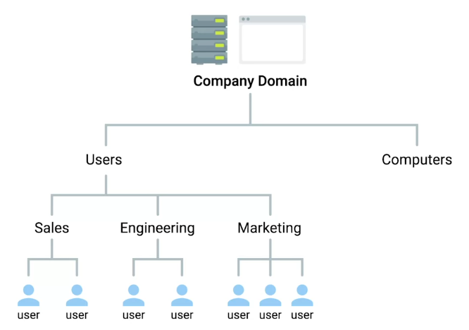
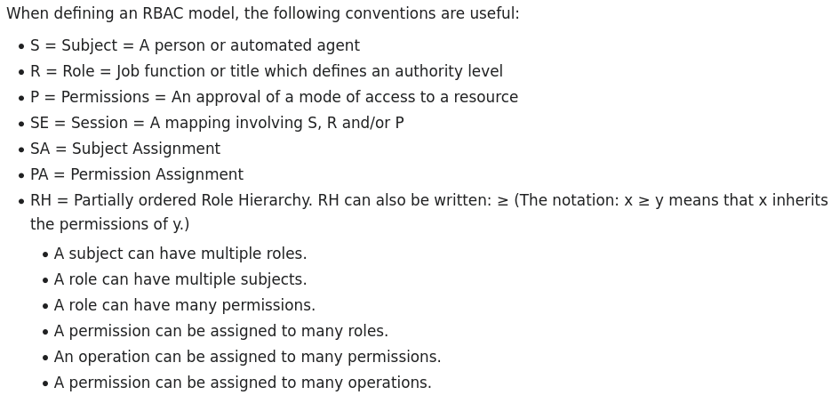
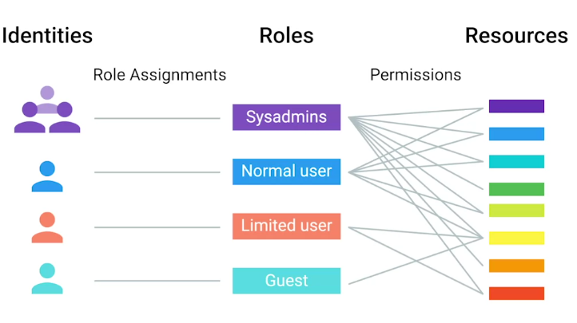

# Introduction to Directory Services

## What is a directory server?

"Contains a lookup service that provides mapping between network resources and their network addresses."

A sysadmin will be responsible for directory server:

  + Setup

  + Configuration

  + Maintenance

### Replication

The stored directory data can be copied and distributed across a number of physically distributed servers, but still appear as one, unified data store for querying and administrating.

### Directory services

Useful for organizing data and making it searchable for an organization.

 

## Implementing Directory Services

Directory services became an open network standard for interoperability among different vendors.

  + Directory Access Protocol or DAP

  + Directory System Protocol or DSP

  + Directory Information Shadowing Protocol or DISP

  + Directory Operational Bindings Management Protocol or DOP

The most popular of these alternatives was:

  + Lightweight Directory Access Protocol or LDAP

The popular industry implementation of these protocols are:

  + Microsoft Active Directory or AD

  + OpenLDAP

# Centralized Management

## What is centralized management?

"A central service that provides instructions to all the different parts of company's IT infrastructure."

  + Directory services provide centralized **authentication, authorization**, and **accounting**, also known as **AAA**.

  + **Role base access control or RBAC** is super important in centralized management to restrict access to authorized users only.

 

There super powerful configuration management automation software tools like:

  + Chef

  + Puppet

  + SCCM

 
