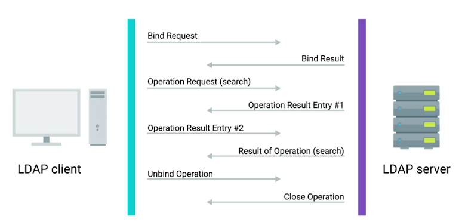
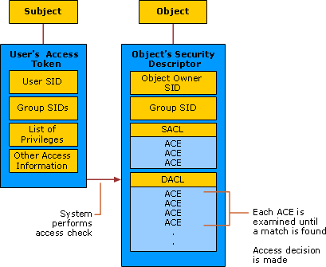
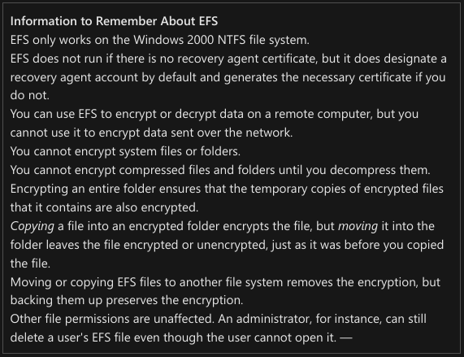
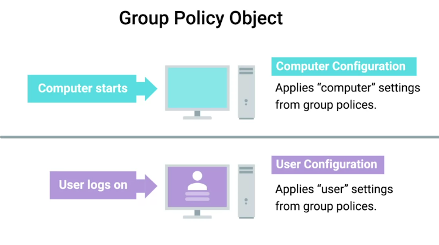

<!-- START doctoc generated TOC please keep comment here to allow auto update -->
<!-- DON'T EDIT THIS SECTION, INSTEAD RE-RUN doctoc TO UPDATE -->
**Table of Contents**  *generated with [DocToc](https://github.com/thlorenz/doctoc)*

- [Introduction to Directory Services](#introduction-to-directory-services)
  - [What is a directory server?](#what-is-a-directory-server)
    - [Replication](#replication)
    - [Directory services](#directory-services)
  - [Implementing Directory Services](#implementing-directory-services)
- [Centralized Management](#centralized-management)
  - [What is centralized management?](#what-is-centralized-management)
- [LDAP](#ldap)
  - [What is LDAP?](#what-is-ldap)
  - [What is LDAP Authentication](#what-is-ldap-authentication)
    - [Kerberos](#kerberos)
- [Active Directory](#active-directory)
  - [What is Active Directory?](#what-is-active-directory)
  - [Managing Active Directory Users and Groups](#managing-active-directory-users-and-groups)
  - [Managing Active Directory User Passwords](#managing-active-directory-user-passwords)
  - [Joining an Active Directory Domain](#joining-an-active-directory-domain)
    - [Forest and Domain Functional Levels](#forest-and-domain-functional-levels)
  - [What is Group Policy?](#what-is-group-policy)
    - [Group Policy Object (GPO)](#group-policy-object-gpo)
    - [Policies](#policies)
    - [Group policy preferences](#group-policy-preferences)
    - [Windows Registry](#windows-registry)
  - [Group Policy Creation and Editing](#group-policy-creation-and-editing)
  - [Group Policy Inheritance and Precedence](#group-policy-inheritance-and-precedence)
  - [Group Policy Troubleshooting](#group-policy-troubleshooting)
  - [Mobile Device Management (MDM)](#mobile-device-management-mdm)
    - [Remote wipe](#remote-wipe)
- [OpenLDAP](#openldap)
  - [What is OpenLDAP?](#what-is-openldap)
  - [Managing OpenLDAP](#managing-openldap)
    - [ldapadd](#ldapadd)
    - [ldapmodify](#ldapmodify)
    - [ldapdelete](#ldapdelete)
    - [ldapsearch](#ldapsearch)

<!-- END doctoc generated TOC please keep comment here to allow auto update -->

# Introduction to Directory Services

## What is a directory server?

"Contains a lookup service that provides mapping between network resources and their network addresses."

A sysadmin will be responsible for directory server:

  + Setup

  + Configuration

  + Maintenance

### Replication

The stored directory data can be copied and distributed across a number of physically distributed servers, but still appear as one, unified data store for querying and administrating.

### Directory services

Useful for organizing data and making it searchable for an organization.

 

## Implementing Directory Services

Directory services became an open network standard for interoperability among different vendors.

  + Directory Access Protocol or DAP

  + Directory System Protocol or DSP

  + Directory Information Shadowing Protocol or DISP

  + Directory Operational Bindings Management Protocol or DOP

The most popular of these alternatives was:

  + Lightweight Directory Access Protocol or LDAP

The popular industry implementation of these protocols are:

  + Microsoft Active Directory or AD

  + OpenLDAP

# Centralized Management

## What is centralized management?

"A central service that provides instructions to all the different parts of company's IT infrastructure."

  + Directory services provide centralized **authentication, authorization**, and **accounting**, also known as **AAA**.

  + **Role base access control or RBAC** is super important in centralized management to restrict access to authorized users only.

 

There super powerful configuration management automation software tools like:

  + Chef

  + Puppet

  + SCCM

 

# LDAP

## What is LDAP?

"Used to access information in directory services like over a network."

The most famous one which use LDAP:

  + AD

  + OpenLDAP

LDIF (LDAP data Interchange Format) has following fields.

  + dn

  distinguished name

  This refers to the name that uniquely identifies an entry in the directory.

  + dc

  domain component

  This refers to each component of the domain.

  + ou

  organizational unit

  This refers to the organizational unit (or sometimes the user group) that user is part of.

  + cn

  common name

  This refers to the individual object (person's name; meeting room; recipe name; job title; etc.) for whom/which you are querying.

## What is LDAP Authentication

There are three ways of LDAP authentication:

  + Anonymous

  + Simple

  + SASL - Simple Authentication & Security Layer
  
  The common SASL authentication technique is **Kerberos**.

 

### Kerberos

A network authentication protocol that's used to authenticate user identity, secure the transfer of user credentials, and more.

# Active Directory

## What is Active Directory?

The native directory service for Microsoft Windows.

  + Central point for managing **Group Policy Objects or GPOs**.

## Managing Active Directory Users and Groups

Local user accounts and security groups are managed by the **Security Accounts Manager (SAM) on a local computer.

 

There are three group scopes:

  + Universal

  + global

  + domain local

## Managing Active Directory User Passwords

Passwords are stored as **cryptographic hash**.

If there's more than one person who can **authenticate** using the same username and passwords, then **auditing** become difficult or even impossible.

  + If a user forgets his/her password, you as a sysadmin can reset their password for them.

  + Password reset will wipe out any encrypted files on the user's computer.

  + Designated user accounts, called recovery agents > accounts are issued recovery agent certificates with public keys and private keys that are used for EFS data recovery operations.

 

## Joining an Active Directory Domain

A computer not part of the AD is called a WorkGroup computer.

**Settings > System and Security > System > Computer name, domain and workgroup settings**

From CLI:

```powershell
Add-Computer -DomainName 'example.com' -Server 'dc1'
```

To get domain functional level:

```powershell
Get-AdForest
```

```powershell
Get-AdDomain
```

### Forest and Domain Functional Levels

Functional levels determine the available AD Domain Service (AD DS) domain or forest capabilities. They also determine which Windows Server OS you can run on domain controllers in the domain or forest.

## What is Group Policy?

### Group Policy Object (GPO)

A set of policies and preferences that can be applied to a group of objects in the directory.

  + When you link a GPO, all the computers or users under that domain, site, or OU will have that policy applied.

  + A GPO can contain **computer configuration, user configuration**, or both.

 

  + **Group Policy Management** tool or `gpms.msc`, to change GPOs.

### Policies

Settings that are reapplied every few minutes, and aren't meant to be changed even by the local administrators.

  + By default, a GPO, will be applied every **90mins**, so OUs don't drift away from policies.

### Group policy preferences

Settings that, in many cases, are meant to be a template for settings.

### Windows Registry

A hierarchical database of settings that Windows, and many Windows applications, use for storing configuration data.

  + GPOs are applied by changing Windows Registry settings.

## Group Policy Creation and Editing

Always make backup before creating new policies or editing existing ones.

## Group Policy Inheritance and Precedence

When a computer is processing GPO that apply to it, all of these policies will be applied in **Precedence** rules.

  + Resultant Set of Policy or RSOP report is used to review applied policies and preferences.

When GPOs collide, they're applied:

**Site --> Domain --> OU (Applied from least specific to the most specific)**

## Group Policy Troubleshooting

One of the most common issues you might encounter is when a user isn't able to log in to their computer, or isn't able to authenticate to the Active Directory domain.

  + Maybe user locked out due to multiple failed log-in attempts.

  + Some time they just forget their password.

  + Start with the simplest problem statement, like maybe there is a network connectivity issue, not directly from AD troubleshooting.

  + Maybe there is problem with **DNS record** and computer cannot find **src-record**.

  + The SRV records that we're interested in are _ldap._tcp.dc_msdcs.Domain.Name, where DOMAIN.NAME is the DNS name of our domain.

```powershell
Resolve-DNSName -Type SRV -Name _ldap._tcp.dc._msdcs.example.com
```

  + Maybe there is clock sync issue

A common issue that you might have to troubleshoot is when a GPO-defined policy or preference **fails to apply to a computer**.

  + Maybe issue with application of GPOs, **Fast Logon Optimization**.

  + GPO update may partially apply.

```powershell
gpupdate /force /sync
```

  + Some time of policies are only applied when computer is rebooted or user logoff and logon back.

  + Replication failure may occur.

```powershell
$env:LOGONSERVER
```

To know why particular isn't applying to a computer, generate a RSOP (Resultant Set of Policy) report.

```powershell
gpresult /R
```

To get the full report:

```powershell
gpresult /H test.html
```

## Mobile Device Management (MDM)

The mobile OS takes MDM profiles or policies that contains settings for the device. You can use MDM to do a bunch of things:

  + Automatically installing apps

  + Pre-configuring wireless networks

  + Enforcing security settings like turning on encryption of the device's storage

  + Remote wipe a device

MDM policy settings are specific to each OS. Those policies can be created and distributed **Enterprise mobility management (EMM)**.

### Remote wipe

A factory reset that you can trigger from your central MDM, rather than having to do it in person on the device.

# OpenLDAP

## What is OpenLDAP?

 OpenLDAP is an open source implementation of Lightweight Directory Access Protocol (LDAP)

  + Using LDAP Data Interchange Fromat (LDIF), you can authenticate, add, remove users, groups and so on in the active directory service.

  + Works on Linux, Windows and MacOS.

To install it on Debian and Debian-based distros:

```bash
sudo apt install slapd ldap-utils
```

Then we'll reconfigure the `slapd` package:

```bash
sudo dpkg-recofigure slapd
```

Now you have a running `ldap` server.

To get Web Interface:

```bash
sudo apt install phpldapadmin
```

Web server is now configured to serve the application, but we need to make additional changes. We need to configure `phpldapadmin` to use our domain, and not to autofill the LDAP login information

```bash
sudo vim /etc/phpldapadmin/config.php
```

Look for the line that start with `$ servers->setValue('server','name`

```bash
$server->setValue('server','name','Example LDAP')
```

Next, move down to the `$servers->setValue('server','base'` line.

```bash
$servers->setValue('server','base', array('dc=example,dc=com'));
```

Now find the login `bind_id` configuration line, and comment it out with `#`

```bash
#$servers->setValue('login','bind_id','cn=admin,dc=example,dc=com');
```

The last thing that we need to adjust is a setting that controls the visibility of some phpLDAPadmin warning messages. By default the application will show quite a few warning messages about template files. These have no impact on our current use of the software. We can hide them by searching for the `hide_template_warning` parameter, uncommenting the line that contains it, and setting it to **true**:

```bash
$config->custom->appearance['hide_template_warning'] = true;
```

Now login to Web-Interface:

```bash
https://example.com/phpldapadmin
```

[How to Configure OpenLDAP Web-Interface](https://www.digitalocean.com/community/tutorials/how-to-install-and-configure-openldap-and-phpldapadmin-on-ubuntu-16-04) 

## Managing OpenLDAP

### ldapadd

Takes the input of an LDIF file and adds the context of the files.

### ldapmodify

Modifies an existing object.

### ldapdelete

Will remove the object that the LDIF file refers to.

### ldapsearch

Will search for entries in your directory database.

[For information about how to use LDIF files to make changes to an OpenLDAP system](https://www.digitalocean.com/community/tutorials/how-to-use-ldif-files-to-make-changes-to-an-openldap-system)
